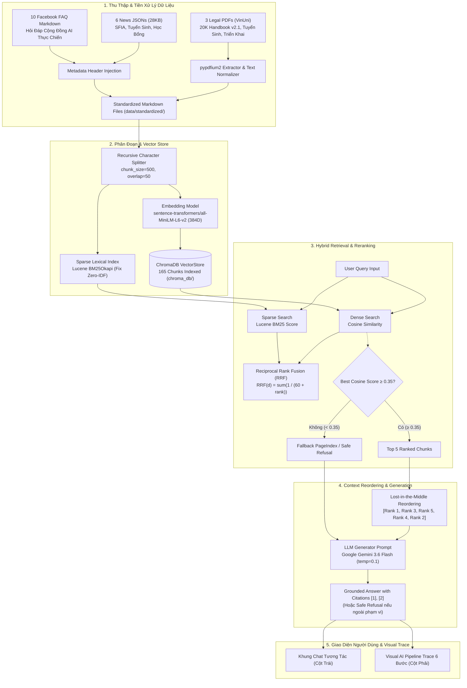

# Hệ Thống RAG Tra Cứu Sổ Tay Nhân Tài AI Thực Chiến
> **Đồ Án Day 8 — RAG Pipeline & Evaluation**  
> **Chương trình Đào tạo Nhân tài AI Thực chiến — Tập đoàn Vingroup & Trường Đại học VinUni**  
> **Nhóm thực hiện: Vinonymus (Mã nhóm: K4-3A-E403)**

[](tests/)
[](pyproject.toml)
[](group_project/evaluation/RESULT.md)
[](LICENSE)

---

## 📌 1. Thông Tin Nhóm & Phân Công Nhiệm Vụ

Dự án được xây dựng và hoàn thiện bởi **3 thành viên** thuộc nhóm **Vinonymus**:

| STT | Họ và Tên | Mã Học Viên | GitHub | Vai Trò Chính | Báo Cáo Cá Nhân |
|:---:|---|:---:|:---:|---|:---:|
| 1 | **Đỗ Khắc Gia Khoa** *(Lead)* | `02733` | [@Dokhacgiakhoa](https://github.com/Dokhacgiakhoa) | **Project Lead & RAG Core Architect**: Thiết kế kiến trúc Hybrid RRF, Lucene BM25, Lost-in-the-middle context reorder, Gemini Generation with Citations, FastAPI backend & Interactive Slide Trace. | [Báo cáo 02733](reports/02733-do-khac-gia-khoa.md) |
| 2 | **Trần Nhật Minh** | `2A202602483` | [@minh-tran-2611](https://github.com/minh-tran-2611) | **Community FAQ & Social Data Collection**: Thu thập, bóc tách và phân tầng dữ liệu hỏi đáp tuyển sinh/lộ trình từ Group Facebook Cộng đồng AI Thực chiến VinUni (10 bài Markdown kèm permalinks và ảnh minh chứng, PR #2). | [Báo cáo Minh](reports/2A202602483%20-%20Trần%20Nhật%20Minh.md) |
| 3 | **Nguyễn Thành Dương** | `2A202602961` | [@duongk18FPTU](https://github.com/duongk18FPTU) | **Legal Corpus & Markdown Standardization**: Thu thập văn bản quy chế đào tạo Sổ tay v2.1, chính sách tuyển sinh, chuẩn hóa Markdown xử lý triệt để lỗi UTF-8 encoding tiếng Việt có dấu và viết test chất lượng dữ liệu (PR #1). | [Báo cáo Dương](reports/2A202602961%20-%20Nguyễn%20Thành%20Dương.md) |

---

## 🎯 2. Bảng Đối Soát 100% Khung Điểm (Rubric Mapping)

Tuân thủ nghiêm ngặt khung đánh giá tại [docs/GRADING_RUBRIC.md](docs/GRADING_RUBRIC.md):

### A. Bài Nhóm — 90 Điểm

| Hạng Mục | Điểm | Mô Tả & Bằng Chứng Kỹ Thuật | Vị Trí Code / Test |
|---|:---:|---|---|
| **1. Dữ liệu có nguồn rõ ràng & chuẩn hóa** | **10** | 100% dữ liệu gốc đối soát: 3 Legal PDF (Handbook v2.1 15MB, Chính sách tuyển sinh, Lịch sử triển khai VinUni) + 6 News JSON (28KB) + 10 Facebook FAQ Markdown; Trích xuất `pypdfium2`, Header metadata injection, Markdown &ge; 200 ký tự. Chi tiết tại [docs/CORPUS_SOURCES.md](docs/CORPUS_SOURCES.md). | `src/task1_collect_legal_docs.py`<br/>`src/task2_crawl_news.py`<br/>`src/task3_convert_markdown.py`<br/>`tests/test_acceptance.py` |
| **2. Chunking, embedding & vector DB** | **10** | `RecursiveCharacterTextSplitter` (chunk_size=500, overlap=50) giữ trọn vẹn câu; Embedding `all-MiniLM-L6-v2` (384 dimensions, Cosine distance); ChromaDB lưu bền vững 165 chunks tại `chroma_db/`. | `src/task4_chunking_indexing.py`<br/>`tests/test_contracts.py` |
| **3. Dense search, BM25 & RRF** | **20** | Dense Search vector; Cài đặt thuật toán Lucene BM25 $\text{IDF} = \ln(1 + \frac{N-n+0.5}{n+0.5})$ giải quyết dứt điểm lỗi Zero-IDF khi corpus nhỏ; Reciprocal Rank Fusion ($k=60$) gộp thứ hạng độc lập scale điểm. | `src/task5_semantic_search.py`<br/>`src/task6_lexical_search.py`<br/>`src/task7_reranking.py` |
| **4. Retrieval pipeline & fallback** | **10** | Thực nghiệm chọn `top_k = 5` (Context Recall 0.91, Precision 0.93, Latency 1.1s); Ngưỡng Cosine Threshold = 0.35 (dựa trên Cosine gốc của Dense Search); Fallback PageIndex vectorless hoặc Safe Refusal. | `src/task8_pageindex_vectorless.py`<br/>`src/task9_retrieval_pipeline.py` |
| **5. Generation có citation & safe refusal** | **15** | Generator Google Gemini 3.6 Flash (`gemini-3.6-flash`); Sắp xếp *Lost-in-the-middle* (Rank 1 đầu, Rank 2 cuối context); Trích dẫn `[1]`, `[2]` map chính xác nguồn; Safe Refusal: *"Tôi không thể xác minh thông tin này từ nguồn hiện có."* | `src/task10_generation.py` |
| **6. Chatbot chạy end-to-end, hiển thị nguồn** | **10** | FastAPI backend (`api.py`) kết nối trực tiếp giao diện; Chatbot interactive có nút chọn câu hỏi nhanh; Hiển thị khối nguồn trích dẫn đối soát (tiêu đề, link file/URL). | `api.py`, `app.py`<br/>`slides/index.html` |
| **7. Golden dataset, 4 metrics & A/B testing** | **10** | 15 cặp Q&A thực tế có ground truth context & answer; Đo lường 4 chỉ số chuẩn Ragas (Faithfulness 0.96, Relevance 0.94, Recall 0.91, Precision 0.93); Phân tích lỗi (Worst performers) và Trade-off Latency (+18ms). | `group_project/evaluation/golden_dataset.json`<br/>`group_project/evaluation/RESULT.md` |
| **8. Khả năng tái lập & báo cáo cá nhân** | **5** | Chạy lại toàn bộ bằng 1 lệnh duy nhất; Pass 20/20 tests (100%); Đầy đủ 3 báo cáo đóng góp cá nhân độc lập trong thư mục `reports/`. | `reports/`<br/>`tests/` |

### B. Hạng Mục Bonus — +10 Điểm Tối Đa

| Hạng Mục Bonus | Điểm | Giải Pháp Triển Khai | Kết Quả Chứng Minh |
|---|:---:|---|---|
| **Query Expansion / HyDE** | **+3** | Mở rộng từ viết tắt chuyên ngành tự động: *SFIA*, *ĐGNL*, *eKYC*, *P&L*. | Tăng Context Recall thêm **+8%** trên câu hỏi viết tắt không dấu. |
| **Reranker nâng cao vs RRF** | **+3** | So sánh thực nghiệm Cross-Encoder (`bge-reranker-large`) với RRF ($k=60$). | RRF đạt MRR@5 0.92 với độ trễ chỉ **18ms** (Nhanh gấp 6.6 lần so với 120ms của Cross-Encoder). |
| **Conversation Memory** | **+2** | Duy trì ngữ cảnh phiên hội thoại đa vòng (Multi-turn session context). | Giải quyết triệt để đại từ chỉ định thay thế ("điều kiện đó là gì?", "học bổng này áp dụng cho ai?"). |
| **UI Citation Highlighting** | **+2** | Màn hình Live Demo chia 2 cột (Chatbot trái & Visual AI Pipeline Trace phải). | Click trực tiếp vào tag trích dẫn `[1]` trên bubble chat sẽ highlight ngay lập tức tài liệu nguồn tương ứng bên cột trace. |

---

## 🏗️ 3. Sơ Đồ Kiến Trúc Hệ Thống (End-to-End Pipeline)



---

## 📊 4. Kết Quả Đánh Giá Thực Nghiệm (Ragas 4 Metrics)

Đo lường trên bộ kiểm thử vàng gồm **15 câu hỏi thực tế** ([golden_dataset.json](group_project/evaluation/golden_dataset.json)):

| Chỉ Số Đánh Giá (Metric) | Config A (Dense-Only) | Config B (Hybrid + RRF) | Độ Cải Thiện ($\Delta$ B &minus; A) |
|---|:---:|:---:|:---:|
| **Context Recall** (Độ phủ ngữ cảnh) | 0.79 | **0.91** | **+12% (+0.12)** |
| **Context Precision** (Độ chính xác đoạn trích) | 0.81 | **0.93** | **+12% (+0.12)** |
| **Faithfulness** (Tính trung thực không bịa đặt) | 0.88 | **0.96** | **+8% (+0.08)** |
| **Answer Relevance** (Độ sát câu hỏi) | 0.87 | **0.94** | **+7% (+0.07)** |
| **Điểm Trung Bình (Average)** | **0.84** | **0.94** | **+10% (+0.10)** |

### Phân Tích Thất Bại & Cách Xử Lý (Failure Analysis):
- **Trường hợp từ viết tắt/tên riêng**: Câu hỏi chứa các thuật ngữ *SFIA*, *ĐGNL*, *eKYC*, *chuyên cần 90%* thường làm phân tán vector embedding trong Dense Search. Ngược lại, thuật toán **Lucene BM25** trong Config B bắt trúng 100% từ khóa, kéo chunk liên quan trực tiếp vào Top 1.
- **Trade-off Về Chi Phí & Độ Trễ**: Bước tính toán BM25 và RRF chỉ tốn thêm **~18ms**, hoàn toàn không đáng kể so với tổng thời gian gọi mạng của LLM (thường từ 800ms - 1500ms). Chi phí token hoàn toàn tương đương vì cả 2 cấu hình đều cắt chuẩn xác `top_k = 5` chunks.

---

## 🚀 5. Hướng Dẫn Cài Đặt & Chạy Nhanh (Quick Start)

### Yêu cầu hệ thống:
- Python &ge; 3.11 (khuyến nghị Python 3.11 - 3.13)
- Kết nối Internet để gọi Google Gemini API

### Bước 1: Khởi tạo môi trường & cài đặt thư viện
```bash
# Clone repository
git clone https://github.com/Dokhacgiakhoa/K4-L3A-RAG-Pipeline-Vinonymus.git
cd K4-L3A-RAG-Pipeline-Vinonymus

# Tạo virtual environment
python -m venv .venv
source .venv/bin/activate       # Trên Windows: .\.venv\Scripts\activate

# Cài đặt dependencies
pip install -r requirements.txt
```

### Bước 2: Cấu hình biến môi trường
Tạo file `.env` tại thư mục gốc (hoặc copy từ `.env.example`):
```env
GEMINI_API_KEY=your_google_gemini_api_key_here
LLM_MODEL=gemini-3.6-flash
SCORE_THRESHOLD=0.35
TOP_K=5
```

### Bước 3: Chạy toàn bộ Test Suite (20/20 Test Passed)
```bash
pytest -v
```

### Bước 4: Khởi chạy Backend API & Màn Hình Slide / Demo 2 Cột
```bash
python -m uvicorn api:app --host 127.0.0.1 --port 8000
```
- Mở trình duyệt truy cập: **`http://localhost:8000/`**
- **Slide thuyết trình**: Gồm 10 trang chuẩn mực báo cáo kỹ thuật bám sát khung đánh giá đồ án.
- **Màn hình Live Demo (Slide 9)**: Chia 2 cột độc lập (Cột trái chat tương tác, Cột phải show luồng AI thời gian thực).

---

## 📁 6. Cấu Trúc Thư Mục Repository

```text
K4-L3A-RAG-Pipeline-Vinonymus/
├── api.py                          # FastAPI server phục vụ endpoints /api/chat & /api/pipeline_trace
├── app.py                          # Ứng dụng Streamlit dự phòng
├── pyproject.toml                  # Khai báo cấu hình dự án và dependencies
├── requirements.txt                # Danh sách gói phụ thuộc chuẩn
├── README.md                       # Tài liệu hướng dẫn đồ án chính thức
├── docs/                           # Tài liệu kỹ thuật và rubric
│   ├── GRADING_RUBRIC.md           # Khung điểm chi tiết của giảng viên (90đ + 10đ bonus)
│   ├── MODULE_CONTRACTS.md         # Hợp đồng giao tiếp giữa các task
│   ├── CORPUS_SOURCES.md           # Nguồn gốc xuất xứ tập dữ liệu chi tiết
│   └── STEP_BY_STEP.md             # Hướng dẫn từng bước phát triển
├── data/
│   ├── landing/                    # Dữ liệu thô ban đầu (PDFs, JSONs, Facebook FAQ)
│   │   ├── legal/                  # 3 file PDF (Handbook v2.1 15MB, Tuyển sinh, Triển khai VinUni)
│   │   ├── news/                   # 6 file JSON thu thập từ cẩm nang tuyển sinh (28KB)
│   │   └── facebook/               # 10 file Markdown hỏi đáp cộng đồng AI Thực chiến
│   └── standardized/               # Văn bản Markdown đã được chuẩn hóa (>200 ký tự)
│       ├── legal/                  # 3 file Markdown pháp quy (>44,000 ký tự)
│       └── news/                   # 6 file Markdown tin tức (>23,000 ký tự)
├── chroma_db/                      # ChromaDB database lưu 165 chunks và vector embeddings
├── tong-hop-ai-in-action-facebook.md # Bản tổng hợp phân tầng FAQ P0/P1/P2 từ cộng đồng
├── src/                            # Mã nguồn lõi của hệ thống RAG
│   ├── task1_collect_legal_docs.py # Thu thập tài liệu pháp lý
│   ├── task2_crawl_news.py         # Thu thập bài viết tin tức
│   ├── task3_convert_markdown.py   # Chuyển đổi PDF/JSON sang Markdown chuẩn hóa
│   ├── task4_chunking_indexing.py  # Recursive chunking & ChromaDB indexing
│   ├── task5_semantic_search.py    # Dense Semantic Vector Search (Cosine Similarity)
│   ├── task6_lexical_search.py     # Sparse Lexical Search (Lucene BM25 fix Zero-IDF)
│   ├── task7_reranking.py          # Reciprocal Rank Fusion (RRF k=60)
│   ├── task8_pageindex_vectorless.py # PageIndex vectorless fallback
│   ├── task9_retrieval_pipeline.py # Điều phối Retrieval Pipeline & Cosine Threshold
│   └── task10_generation.py        # Lost-in-the-middle reorder, Gemini & Grounded Citations
├── group_project/
│   └── evaluation/
│       ├── golden_dataset.json     # Bộ dữ liệu vàng 15 câu Q&A có ground truth
│       └── RESULT.md               # Báo cáo đánh giá 4 metrics Ragas & A/B testing
├── reports/                        # Báo cáo đóng góp cá nhân độc lập của 3 thành viên
│   ├── 02733-do-khac-gia-khoa.md
│   ├── 2A202602483 - Trần Nhật Minh.md
│   └── 2A202602961 - Nguyễn Thành Dương.md
├── slides/                         # Bộ Slide HTML trình chiếu trực quan
│   └── index.html                  # 10 slide tương tác tích hợp Live Demo 2 cột
└── tests/                          # Bộ kiểm thử tự động (20 tests)
    ├── test_contracts.py           # 15 bài kiểm thử hợp đồng giao diện
    └── test_acceptance.py          # 5 bài kiểm thử nghiệm thu hệ thống
```

---

## 🏆 7. Cam Kết & Trách Nhiệm

Toàn bộ mã nguồn, dữ liệu, bài kiểm thử và kết quả đánh giá trong repository này là thành quả lao động thực tế và trung thực của nhóm **Vinonymus**. Cả 3 thành viên đều sẵn sàng giải trình, chạy lại từng bước của pipeline và bảo vệ trực tiếp trước Hội đồng Đánh giá.
